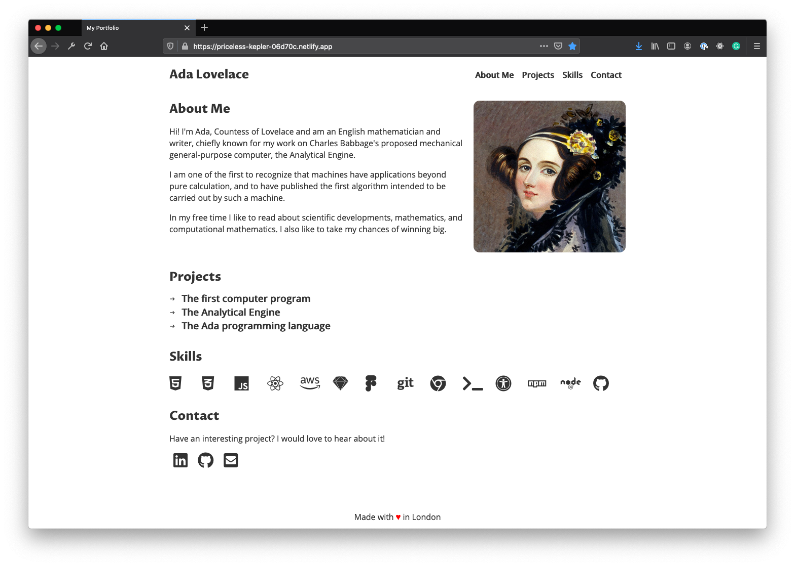

# **Personal Portfolio Website**

This [site](https://daniellabrador.me) showcases my projects and qualifications as a web developer. All the necessary contact information is provided in the site for potential employers. This was part of [Codecademy's Full-Stack Career Path](https://www.codecademy.com/learn/paths/full-stack-engineer-career-path).

## Table of Contents

- [Codecademy Project Prompt](#codecademy-project-prompt)
- [Technologies](#technologies)
- [Setup](#setup)
- [Sources](#sources)

## Codecademy Project Prompt

### Portfolio Website

For this project, you will build a personal portfolio site, a static website where you can share the projects that you build in this [Path]((https://www.codecademy.com/learn/paths/full-stack-engineer-career-path)). Typically, a portfolio website will have a main page that features different projects that you’ve built and another page that contains contact information, in case someone wants to reach out to you. Occasionally, there are additional pages for each project, detailing the technology used.

### Example Project

### Project Objectives

- Build a website using HTML, CSS
- Add at least one interactive feature using JavaScript
- Use Git version control
- Use the command line and file navigation
- Develop locally on your computer
- Deploy your site to the web using GitHub Pages
- OPTIONAL: Buy a custom domain name and have it point to your GitHub Pages website

### Prerequisite Knowledge

- HTML/CSS
- JavaScript
- Git and GitHub
- Command line and file navigation

## Technologies

- HTML 5
- CSS 3
- JavaScript ES6

## Setup

The site is constantly evolving. To check the latest version of the site, click [here](https://daniellabrador.me).

## Sources

The techniques utilized was based on the lessons taught in [Codecademy's Full-Stack Engineer Course](https://www.codecademy.com/learn/paths/full-stack-engineer-career-path
).

Some of the design elements were inspired by a fellow Codecademy student's [website](https://wesleycampbell.co.uk/#).
